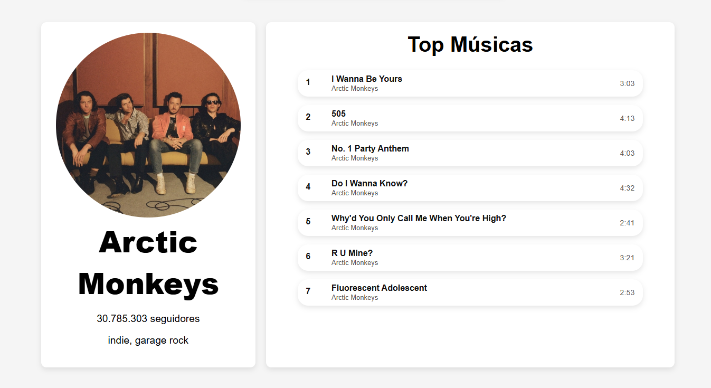
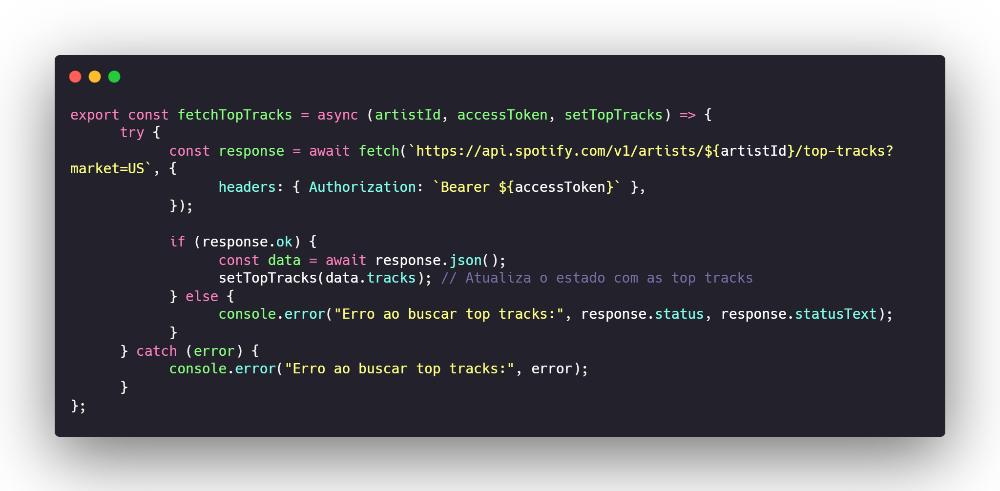

# 🎧 Artists Search – React + Spotify API

**Artists Search** é uma aplicação web desenvolvida com **React** e **Vite**, criada para a disciplina **Programação Web III**. O objetivo do projeto é proporcionar uma experiência interativa e dinâmica de busca por artistas musicais, integrando a API do Spotify para exibir informações em tempo real.




---

## 🔍 Funcionalidades

- **Busca instantânea** de artistas conforme o usuário digita
- **Exibição de detalhes do artista**, como:
  - Foto de perfil
  - Nome
  - Número de seguidores
  - Gêneros musicais (quando disponíveis)
  - As 7 músicas mais populares
- **Itens clicáveis**:
  - Nome do artista → abre o perfil no Spotify (nova aba)
  - Nome das músicas → abre a música no Spotify (nova aba)

---

## 🧪 Tecnologias e Conceitos

- **React** – criação de interfaces declarativas e componentes reutilizáveis
- **Vite** – bundler moderno com hot reload e build rápido
- **Spotify Web API** – integração com API externa real
- **JSX** – sintaxe para combinar HTML com lógica JavaScript
- **Gerenciamento de estado** – controle da busca e resultados em tempo real

---

## 🧠 Organização do Código

A arquitetura do projeto foi pensada para separar responsabilidades:

- `AccessToken.jsx`: autenticação com a API do Spotify
- `SpotifyServices.jsx`: lida com todas as requisições (fetch)
- Componentes reutilizáveis:
  - `SearchBar`, `SearchResultsList`, `ArtistDetail`, `TopTracks`, `Track`

> Abaixo, um trecho da função `fetchTopTracks()` usada para pegar as músicas mais populares:




---

## 📚 Aprendizados

Este projeto reforçou habilidades práticas como:

- Integração com APIs reais usando tokens de autenticação
- Manipulação de dados assíncronos com `fetch` e `async/await`
- Criação de componentes reativos e reutilizáveis
- Práticas de UI/UX para exibição de dados de forma clara
- Deploy de aplicações modernas com Vite

---

## 🚀 Como executar localmente

1. Clone este repositório:
```bash
git clone https://github.com/marianaararipe/artists-search.git
````
2. Instale as dependências com `npm install`  
3. Gere um token manualmente na [Spotify Developer Console](https://developer.spotify.com/documentation/web-api) e substitua em `.AccessToken.jsx` 
4. Inicie o servidor local com `npm run dev`
> O website abrirá em `http://localhost:5173`

---

## 📁 Estrutura do Projeto

```bash
/
├── public/                      # Arquivos públicos (favicon, HTML raiz)
│
├── src/
│   ├── assets/                  # Imagens e ícones utilizados no projeto
│
│   ├── componentes/             # Componentes reutilizáveis da interface
│   │   ├── ArtistDetail.jsx            # Exibe detalhes do artista (foto, nome, seguidores, gêneros)
│   │   ├── ArtistDetail.module.css
│   │   ├── SearchBar.jsx               # Barra de busca por artistas
│   │   ├── SearchBar.module.css
│   │   ├── SearchResult.jsx            # Card de cada artista nos resultados
│   │   ├── SearchResult.module.css
│   │   ├── SearchResultsList.jsx       # Lista com os artistas encontrados
│   │   ├── SearchResultsList.module.css
│   │   ├── TopTracks.jsx               # Lista com as 7 músicas mais populares
│   │   ├── TopTracks.module.css
│   │   ├── Track.jsx                   # Formata cada música (nome, duração, artistas)
│   │   └── Track.module.css
│
│   ├── paginas/                 # Páginas principais
│   │   ├── Layout.jsx                 # Organiza a estrutura da aplicação
│   │   └── Layout.module.css
│
│   ├── AccessToken.jsx          # Faz a autenticação com a API do Spotify
│   ├── SpotifyServices.jsx      # Funções para buscar dados da API (artistas, detalhes, músicas)
│   ├── App.jsx                  # Componente raiz (controla estados principais)
│   ├── App.css
│   ├── index.css
│   └── main.jsx                 # Ponto de entrada da aplicação
│
├── README.md                    # Documentação do projeto
├── index.html                   # HTML base
├── vite.config.js               # Configuração do Vite
├── eslint.config.js             # Regras de lint
├── package.json
└── package-lock.json
````

---

Projeto com fins educacionais – todos os dados e imagens exibidos pertencem à API do Spotify.
Este projeto faz parte da minha formação em Desenvolvimento de Sistemas, para a disciplina **Programação Web III**.  
Veja outros trabalhos em: [meu GitHub](https://github.com/marianaararipe)
